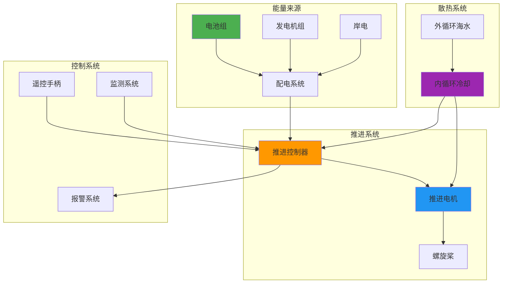

# 交互功能演示

本页展示手册支持的各种交互效果。

---

## 1. Mermaid 流程图/架构图

### 船舶电力推进系统架构



### 能量流动图


---

## 2. 标签页切换

=== "电池系统"
    ### 船用电池系统
    
    - 磷酸铁锂电池：安全性高、循环寿命长
    - 三元锂电池：能量密度高、低温性能好
    - 钛酸锂电池：快充性能优异、安全性极佳
    
    **推荐场景：**
    - 内河船舶：磷酸铁锂
    - 沿海船舶：三元锂
    - 港口作业船：钛酸锂

=== "推进系统"
    ### 电推进系统
    
    - 永磁同步电机：效率最高（96%）
    - 交流异步电机：技术成熟、维护简单
    - 直流电机：调速性能好、结构简单
    
    **选型要点：**
    1. 功率需求
    2. 转速范围
    3. 防护等级（IP67）

=== "控制系统"
    ### 能量管理系统
    
    - 电池管理系统（BMS）
    - 推进控制单元（PCU）
    - 远程监控系统
    
    **核心功能：**
    - 功率分配优化
    - 故障诊断预警
    - 能耗统计分析

---

## 3. 折叠/展开面板

???+ info "什么是电力推进系统？"
    电力推进系统是指用电动机直接驱动螺旋桨的推进方式。
    
    **主要组成部分：**
    - 电源（电池/发电机）
    - 推进电机
    - 控制器
    - 散热系统
    
    **优势：**
    - 效率高（比柴油机高15-20%）
    - 噪音低（降低20-30分贝）
    - 零排放（纯电动模式）

??? warning "安全注意事项"
    !!! danger "高压危险"
        - 系统电压可达 500-800V DC
        - 维修前必须断电并放电
        - 需持证人员操作
    
    !!! warning "防水要求"
        - 所有电气设备需 IP67 防护
        - 定期检查密封件
        - 舱内保持干燥

??? tip "维护小贴士"
    **日常检查清单：**
    
    - [ ] 冷却液液位
    - [ ] 电缆连接紧固
    - [ ] 绝缘电阻测试
    - [ ] 软件版本更新
    - [ ] 滤网清洁

---

## 4. 交互式计算器（已有功能）

### 电池容量估算

<div class="calculator">
  <label>船舶功率需求 (kW):</label>
  <input type="number" id="power" value="100" min="1" max="1000">
  
  <label>续航时间 (小时):</label>
  <input type="number" id="hours" value="4" min="0.5" max="24" step="0.5">
  
  <label>系统效率 (%):</label>
  <input type="number" id="efficiency" value="85" min="50" max="100">
  
  <button onclick="calculateBattery()">计算</button>
  
  <div id="result" class="result"></div>
</div>

<script>
function calculateBattery() {
  const power = parseFloat(document.getElementById('power').value);
  const hours = parseFloat(document.getElementById('hours').value);
  const efficiency = parseFloat(document.getElementById('efficiency').value) / 100;
  
  const capacity = (power * hours) / efficiency;
  
  document.getElementById('result').innerHTML = 
    `<strong>所需电池容量: ${capacity.toFixed(1)} kWh</strong><br>` +
    `<small>考虑 ${efficiency*100}% 系统效率</small>`;
}
</script>

---

## 5. 进度步骤条

<div class="step-indicator">
  <div class="step completed">
    <div class="step-number">1</div>
    <div class="step-title">需求分析</div>
  </div>
  <div class="step completed">
    <div class="step-number">2</div>
    <div class="step-title">方案设计</div>
  </div>
  <div class="step active">
    <div class="step-number">3</div>
    <div class="step-title">设备选型</div>
  </div>
  <div class="step">
    <div class="step-number">4</div>
    <div class="step-title">安装调试</div>
  </div>
  <div class="step">
    <div class="step-number">5</div>
    <div class="step-title">验收交付</div>
  </div>
</div>

---

## 6. 悬浮提示（Tooltip）

<span class="tooltip">电力推进
  <span class="tooltiptext">Electric Propulsion: 用电动机驱动螺旋桨的推进方式</span>
</span>
相比传统
<span class="tooltip">柴油机
  <span class="tooltiptext">Diesel Engine: 以柴油为燃料的内燃机</span>
</span>
具有明显优势。

---

## 7. 数据对比表格

| 推进方式 | 效率 | 噪音 | 排放 | 维护成本 | 初始投资 |
|---------|------|------|------|---------|---------|
| 柴油机 | 35-40% | 高 | 高 | 中 | 低 |
| 电力推进 | 85-96% | 低 | 零 | 低 | 高 |
| 混合动力 | 45-60% | 中 | 低 | 中 | 中 |

---

## 8. 图片点击放大（已有功能）


*点击图片可放大查看*

---

## 9. 代码高亮与复制

```python
# 电池容量计算示例
def calculate_battery_capacity(power_kw, hours, efficiency=0.85):
    """
    计算所需电池容量
    
    参数:
        power_kw: 功率需求 (kW)
        hours: 续航时间 (小时)
        efficiency: 系统效率 (默认85%)
    
    返回:
        电池容量 (kWh)
    """
    return (power_kw * hours) / efficiency

# 示例：100kW 功率，4小时续航
capacity = calculate_battery_capacity(100, 4)
print(f"所需电池容量: {capacity:.1f} kWh")
```

---

## 10. 数学公式（已有功能）

电池容量计算公式：

$$
C = \frac{P \times t}{\eta}
$$

其中：
- $C$ = 电池容量 (kWh)
- $P$ = 功率需求 (kW)
- $t$ = 续航时间 (h)
- $\eta$ = 系统效率 (%)

---

## 使用建议

1. **流程图**：用于展示系统架构、工作流程
2. **标签页**：用于对比不同方案、分类展示
3. **折叠面板**：用于补充说明、安全提示
4. **计算器**：用于参数估算、方案验证
5. **步骤条**：用于引导学习路径、操作流程

---

*更多交互功能持续添加中...*
