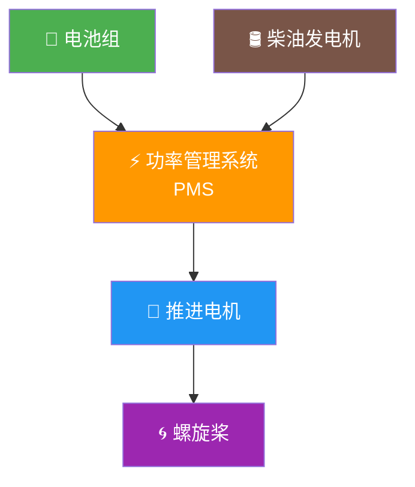

# 第1章 船舶动力系统概述与发展

> 本章回答两个基本问题：船舶动力系统有哪些形式？为什么新能源动力是不可逆的趋势？

## 1.1 传统船舶动力系统

### 1.1.1 柴油机推进

柴油机是目前最主流的船舶动力方式，按转速分为：

| 类型 | 转速范围 | 特点 | 适用船型 |
|------|----------|------|----------|
| 低速二冲程 | 60-250 rpm | 直接驱动螺旋桨，效率最高，体积大 | 大型货船、油轮、散货船 |
| 中速四冲程 | 250-1000 rpm | 需齿轮箱减速，灵活性好 | 客船、渡轮、工程船 |
| 高速四冲程 | 1000-2500 rpm | 体积小功率密度高，寿命短 | 小型船舶、应急发电 |

📌 **核心特征**：燃油能量→热能→机械能，单步转换，系统相对简单可靠。但部分负荷效率差，排放问题日益突出。

### 1.1.2 蒸汽轮机与燃气轮机

- **蒸汽轮机**：可利用多种燃料（含 LNG 蒸发气），主要用于 LNG 船；系统庞大、启动慢
- **燃气轮机**：功率密度高、启动快，但部分负荷油耗高，主要用于军舰和高速船

## 1.2 新能源船舶动力系统

### 1.2.1 纯电池动力

- ✅ 零排放、低噪音、全工况高效率
- ❌ 续航受限于电池能量密度
- 适用：内河短途客船、渡船、港口工作船

### 1.2.2 混合动力

兼顾续航与环保，三种架构：

| 架构 | 说明 | 优点 | 缺点 |
|------|------|------|------|
| 串联 | 柴油机→发电机→电池→电机→桨 | 全电驱动，布置灵活 | 能量转换链长 |
| 并联 | 柴油机和电机都可驱动桨 | 效率高，冗余好 | 机械连接复杂 |
| 插电式 | 可岸电充电，短途纯电 | 灵活性最高 | 依赖充电设施 |

📌 混合动力的深度技术内容见 **第25章**。

### 1.2.3 燃料电池动力

- 氢燃料电池：零排放（只产水），效率 40-60%，高于柴油机
- 甲醇燃料电池：能量密度高，储运方便
- 目前成本高、加氢基础设施稀缺，处于示范阶段

### 1.2.4 风能/太阳能辅助

- 风帆助推：可节省 5-20% 燃油
- 太阳能光伏：辅助供电，功率有限
- 通常作为辅助能源，不作为主推进

## 1.3 发展驱动力

=== "🌍 环保法规"
    ### 环保法规（最强驱动）
    
    - **IMO 2030 目标**：碳强度降低 40%（对比 2008 年）
    - **IMO 2050 目标**：温室气体净零排放（2023 修订战略）
    - **短期措施**：EEXI（现有船能效指数）、CII（碳强度指标评级）
    - **ECA 排放控制区**：硫含量 ≤ 0.1%，国内沿海内河持续扩围

=== "⚡ 技术成熟"
    ### 技术成熟
    
    - 磷酸铁锂电池能量密度提升至 120-160 Wh/kg
    - 船用 BMS 技术趋于成熟
    - 大功率永磁电机效率达 96%+
    - 碳化硅功率器件降低逆变器损耗

=== "💰 经济性"
    ### 经济性改善
    
    - 电池成本持续下降（2020→2026 降幅约 40%）
    - 电价 vs 油价差距拉大
    - 电推进系统运动部件少，维护成本低

=== "📋 政策推动"
    ### 政策推动
    
    - 交通运输部《新能源船舶发展行动方案》：内河优先、港口配套
    - 地方补贴：内河电动船试点项目
    - 港口岸电设施建设加速

## 1.4 全球发展现状

### 1.4.1 挪威——电动船先驱

- **MF Ampere**（2015）：全球首艘全电动商用渡轮，120kWh 电池
- **MF Bastø Electric**（2021）：挪威最大电动渡轮，4.3MWh 电池
- **Color Hybrid**（2019）：插电式混合动力，5MWh 电池

📌 挪威渡轮电气化率已超 70%，计划 2026 年前全部渡轮零排放。

### 1.4.2 欧盟与中国

**欧盟**：TrAM 模块化电动船项目、丹麦 Ellen 号（4.3MWh）、瑞典 Tellus 号工作船

**中国**：
- 「长江三峡1」：全球最大纯电动游船，7500kWh 电池，1000 客位
- 珠江水系电动客船系列、深圳港纯电动拖轮
- 产业链：宁德时代/比亚迪（电池）、中车株洲/湘电（电机）、中船系研究所（集成）

## 1.5 技术瓶颈与突破方向

| 瓶颈 | 现状 | 突破方向 |
|------|------|----------|
| 电池能量密度 | LFP 120-160 Wh/kg | 固态电池 300-400 Wh/kg（2030 预期） |
| 充电基础设施 | MW 级快充稀缺 | 换电模式、无线充电示范 |
| 规范体系 | 内河纯电较完善 | 海船规范持续迭代 |
| 全生命周期成本 | 初始投资高 30-60% | 碳交易、电池回收体系 |

???+ info "💡 核心矛盾详解"
    **船用要求高安全性（LFP 优先），但 LFP 能量密度偏低，大型船舶电池组重量巨大**——这是贯穿本手册所有设计决策的基本约束。
    
    **具体表现：**
    - 一艘 1000 吨级内河货船，纯电续航 100 公里，需电池约 2000 kWh
    - LFP 电池组重量约 12-15 吨，占船重 1.2-1.5%
    - 若用三元锂可减重 30%，但安全性降低，船级社审批难度大
    
    **设计权衡：**
    1. 短途航线：优先 LFP，牺牲续航保安全
    2. 中途航线：混合动力，电池+发电机互补
    3. 长途航线：燃料电池或纯柴油，等待技术突破

??? tip "🔋 电池技术路线对比"
    | 类型 | 能量密度 | 安全性 | 成本 | 船用适用性 |
    |------|---------|--------|------|-----------|
    | 磷酸铁锂 LFP | 120-160 Wh/kg | ⭐⭐⭐⭐⭐ | 低 | ⭐⭐⭐⭐⭐ |
    | 三元锂 NCM | 200-250 Wh/kg | ⭐⭐⭐ | 中 | ⭐⭐⭐ |
    | 钛酸锂 LTO | 80-100 Wh/kg | ⭐⭐⭐⭐⭐ | 高 | ⭐⭐⭐⭐ |
    | 固态电池 | 300-400 Wh/kg | ⭐⭐⭐⭐ | 极高 | ⭐⭐（未来） |

## 1.6 本章小结

- 新能源动力是法规、技术、经济、政策四轮驱动的不可逆趋势
- 纯电池适合内河短途，混合动力适合中长途，燃料电池是未来选项
- 中国在产业链和内河应用上全球领先，海船规范仍在完善
- 下一章：如何为自己的船型选择合适的动力系统（分类与选型）
