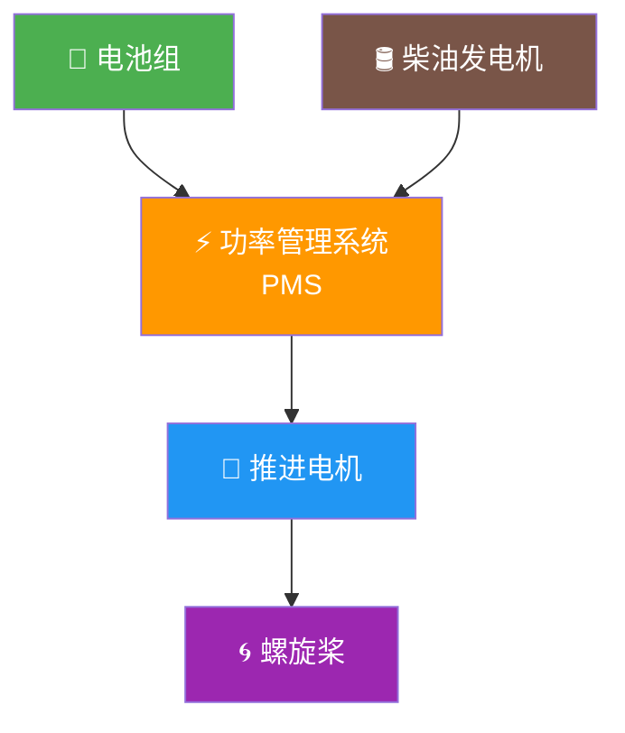
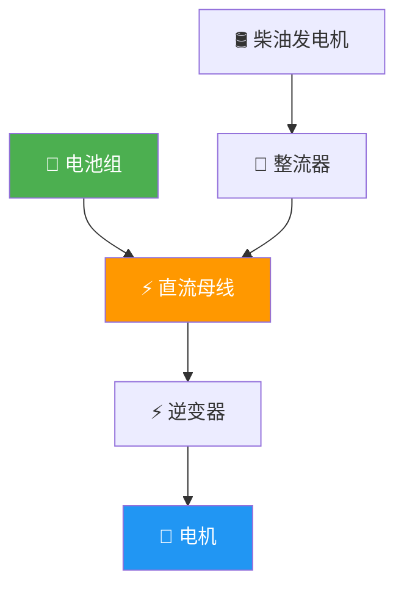
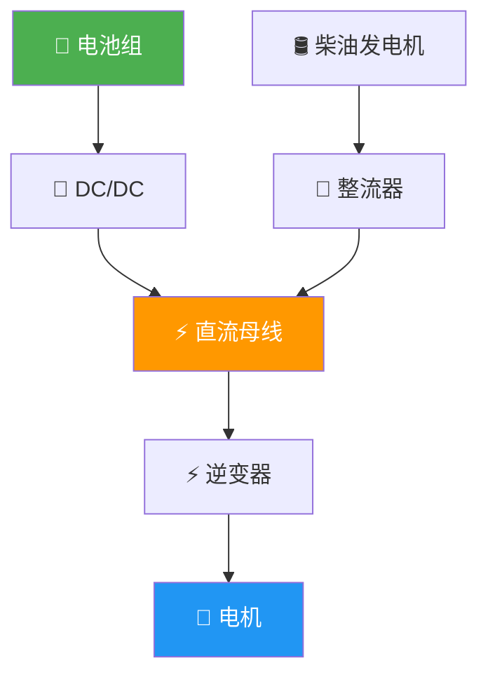

# 船舶动力系统分类

## 1. 按能源类型

### 1.1 纯电池动力


| 特点 | 说明 |
|------|------|
| 排放 | 零排放 |
| 噪音 | 极低（< 65 dB） |
| 续航 | 受电池能量限制（通常 50-200 km） |
| 充电 | 需岸电充电设施 |
| 适用 | 内河短途客船、渡轮、港口工作船 |
| 初始成本 | 高（电池占 30-40%） |
| 运营成本 | 低（电费 < 油费） |

### 1.2 混合动力



| 特点 | 说明 |
|------|------|
| 排放 | 低排放（可减少 20-40%） |
| 续航 | 灵活（电池+燃油双重保障） |
| 复杂度 | 高（两套系统） |
| 适用 | 内河中长途、沿海船舶 |
| 初始成本 | 最高 |
| 运营成本 | 中等 |

### 1.3 燃料电池动力


| 特点 | 说明 |
|------|------|
| 排放 | 零排放（只产水） |
| 续航 | 长（取决于储氢量） |
| 加氢 | 需加氢站（基础设施稀缺） |
| 效率 | 40-60%（高于柴油机） |
| 适用 | 示范项目、特定航线 |
| 成本 | 极高（燃料电池系统昂贵） |

### 1.4 传统柴油动力

| 特点 | 说明 |
|------|------|
| 排放 | 高（NOx、SOx、PM、CO₂） |
| 续航 | 长（加油便捷） |
| 技术 | 成熟可靠 |
| 适用 | 远洋、大功率船舶 |
| 初始成本 | 低 |
| 运营成本 | 高（油价+维护） |

## 2. 按推进方式

### 2.1 直接传动


- 电机直接驱动螺旋桨，无减速装置
- 需低转速大扭矩电机
- 效率最高，结构最简单
- 适合大直径低转速螺旋桨

### 2.2 齿轮箱减速传动


- 电机高转速，经齿轮箱减速到螺旋桨转速
- 电机体积小重量轻
- 齿轮箱效率 95-98%
- 适合空间受限或高速桨

### 2.3 舵桨推进


- 推进+转向一体，操纵性极好
- 无需独立舵系统
- 适合内河、港口船舶
- 分 Z 型驱动（水上电机）和 POD（水下电机）

### 2.4 喷水推进


- 无外露运动部件，浅水适应性好
- 高速效率高（> 25 节）
- 低速效率差
- 适合高速客船、工作艇

## 3. 按电力系统架构

### 3.1 直流组网



- 电池直接挂直流母线
- 效率高，系统简洁
- 适合纯电池动力船

### 3.2 交流组网



- 多源汇流，电压稳定
- 适合混合动力船
- 系统复杂度高

## 4. 选型决策参考

=== "🚢 内河船舶"
    | 船型 | 推荐动力 | 推荐推进 | 理由 |
    |------|----------|----------|------|
    | 内河渡轮 | 纯电池 | 全回转舵桨 | 短途固定航线，操纵要求高 |
    | 内河客船 | 纯电池/混合 | 全回转舵桨 | 中短途，环保要求高 |
    | 港口拖轮 | 纯电池 | 全回转舵桨 | 频繁启停，零排放 |

=== "🌊 沿海船舶"
    | 船型 | 推荐动力 | 推荐推进 | 理由 |
    |------|----------|----------|------|
    | 沿海货船 | 混合动力 | 常规桨+舵 | 续航要求高 |
    | 豪华游船 | 纯电池 | POD | 低噪音，舒适性 |

=== "🌍 远洋船舶"
    | 船型 | 推荐动力 | 推荐推进 | 理由 |
    |------|----------|----------|------|
    | 远洋货船 | 柴油/LNG | 常规桨+舵 | 超长续航，大功率 |
    | 高速客船 | 柴油/混合 | 喷水推进 | 高速效率 |

???+ tip "💡 选型决策流程"
    ```mermaid
    flowchart TD
        A[开始选型] --> B{航线类型?}
        B -->|内河短途| C[纯电池 + 舵桨]
        B -->|内河中长途| D[混合动力 + 舵桨]
        B -->|沿海| E[混合动力 + 常规桨]
        B -->|远洋| F[柴油/LNG + 常规桨]
        
        C --> G{预算充足?}
        D --> G
        E --> G
        F --> G
        
        G -->|是| H[推荐方案]
        G -->|否| I[降配方案<br/>或等待补贴]
        
        style C fill:#4CAF50,color:#fff
        style D fill:#8BC34A,color:#fff
        style E fill:#FF9800,color:#fff
        style F fill:#795548,color:#fff
    ```
