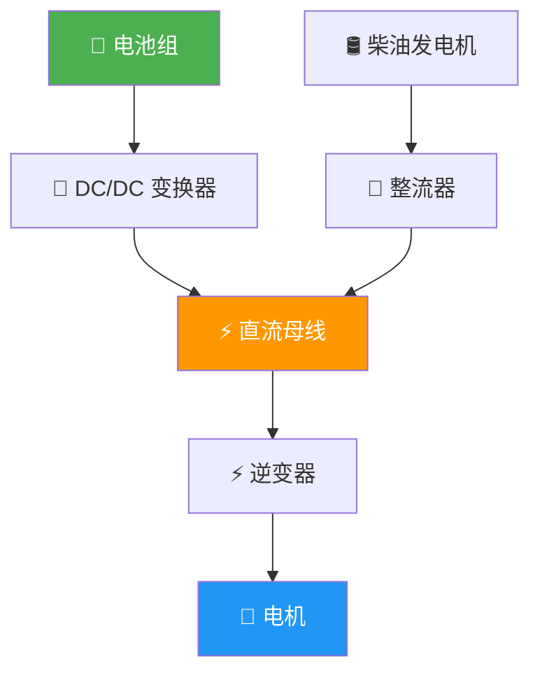

# 电推进系统概述

## 1. 电推进 vs 传统推进

### 1.1 综合对比

| 对比项 | 传统柴油推进 | 电推进 |
|--------|-------------|--------|
| 部分负荷效率 | 差（最佳效率在 80-90% 负荷） | 好（50-100% 负荷效率均高） |
| 全工况效率 | 30-45% | 45-62%（含电池系统） |
| 布置灵活性 | 受轴系位置限制 | 高，电机可任意位置 |
| 噪音振动 | 高（柴油机燃烧爆发） | 低（电机旋转平稳） |
| 响应速度 | 慢（惯性大，5-10 秒加速） | 快（毫秒级扭矩响应） |
| 维护量 | 大（运动件多） | 小（轴承为主） |
| 初始成本 | 低 | 高 30-60% |
| 运营成本 | 高（燃油+维护） | 低（电费+低维护） |
| 环保 | 排放污染 | 零排放（纯电） |

### 1.2 电推进的工程优势

- **瞬时功率响应**：电机可在毫秒内输出最大扭矩，加速性好
- **宽调速范围**：0 到额定转速连续可调，无需齿轮箱换挡
- **四象限运行**：正转/反转 + 电动/发电，天然支持能量回收制动
- **冗余能力**：多电机多桨配置，单机故障不影响安全
- **精确控制**：转速控制精度可达 0.1%，适合动力定位

## 2. 电推进架构

### 2.1 直流推进系统

**特点：**
- 电池直接挂在直流母线上，效率最高
- 系统简洁，无整流环节
- 直流母线电压需与电池匹配
- 适合纯电池动力船

### 2.2 交流推进系统

**特点：**
- 多源汇流，适合混合动力
- 直流母线电压稳定，不随电池 SOC 变化
- 系统复杂度高，效率有额外损耗
- 适合大型混合动力船

### 2.3 直驱 vs 齿轮箱传动

| 方案 | 电机转速 | 效率 | 体积重量 | 适用场景 |
|------|----------|------|----------|----------|
| 直驱 | 100-300 rpm | 最高（无齿轮损耗） | 电机大而重 | 低速大直径桨 |
| 齿轮箱减速 | 1000-2500 rpm | 低 2-3% | 电机小而轻 | 高速桨或空间受限 |
| 皮带传动 | 500-1500 rpm | 低 1-2% | 介于两者之间 | 小型船舶 |

???+ tip "💡 传动方案选择详解"
    **直驱方案：**
    - 优点：效率最高、维护最少、噪音最低
    - 缺点：电机体积大、重量重、成本高
    - 适用：大型船舶、低转速大直径螺旋桨
    
    **齿轮箱方案：**
    - 优点：电机体积小、重量轻、成本低
    - 缺点：齿轮箱效率损失 2-3%、需定期维护
    - 适用：空间受限、高速螺旋桨
    
    **趋势**：永磁同步电机技术进步，低转速大扭矩直驱方案越来越普遍。
