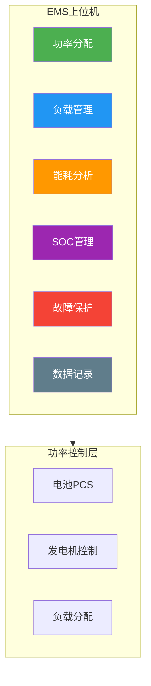
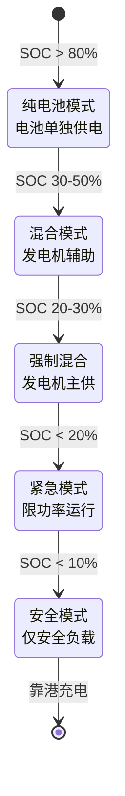
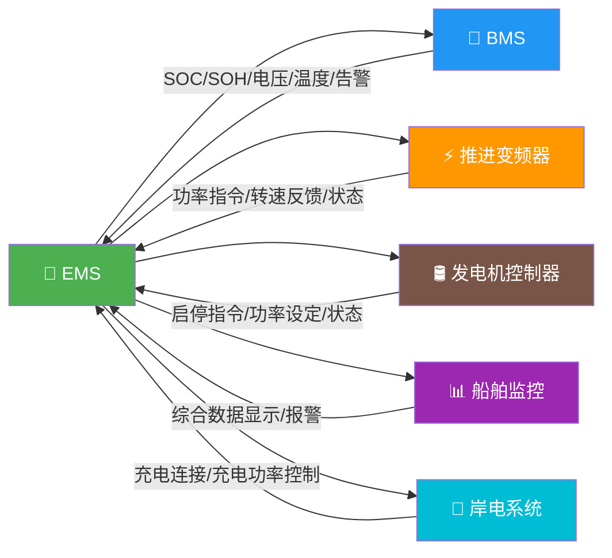

# 能量管理系统（EMS）

## 1. EMS 核心功能

### 1.1 功能架构

### 1.2 功率分配策略

=== "🔋 纯电池模式"
    **适用条件：** 电池充足时（SOC > 30%）
    
    - 电池单独供电
    - 维持 SOC 在 30-90% 区间
    - 根据负载需求动态调整放电功率
    
    **优势：** 零排放、低噪音、效率最高

=== "⚡ 混合模式"
    **适用条件：** 电池中等电量（SOC 20-50%）
    
    - 电池承担基础负载（平稳功率）
    - 发电机承担峰值负载（波动功率）
    - 发电机运行在最优效率点（70-90% 负荷）
    - 峰值时电池补充，低谷时电池充电
    
    **优势：** 兼顾续航与环保，系统灵活

=== "🚨 低电量保护"
    **适用条件：** 电池电量低（SOC < 20%）
    
    - SOC < 20% 时启动发电机
    - SOC < 10% 时限制推进功率
    - SOC < 5% 时仅保留安全负载
    
    **目标：** 确保船舶安全返航

### 1.3 负载优先级管理

| 优先级 | 负载类型 | 说明 |
|--------|---------|------|
| P0（最高） | 舵机、消防泵 | 安全相关，不可断电 |
| P1 | 推进系统 | 核心功能，优先保障 |
| P2 | 导航通信 | 运行必需 |
| P3 | 照明、舱底泵 | 基本生活保障 |
| P4 | 空调、厨房 | 舒适性，可卸载 |
| P5（最低） | 非必需设备 | 紧急时首先断开 |

📌 **功率不足时**：EMS 按优先级从低到高依次卸载，确保安全设备供电。

## 2. 控制策略

### 2.1 规则型控制（最常用）

**基于 SOC 的状态机：**

**优点**：简单可靠，逻辑清晰，调试容易
**缺点**：无法优化全局能效

### 2.2 优化控制

???+ tip "🎯 等效消耗最小化策略（ECMS）"
    **原理：** 将电池电量消耗等效为燃油消耗
    
    **公式：**
    $$
    J = \dot{m}_f + \lambda \cdot \frac{P_{bat}}{\eta_{bat}}
    $$
    
    其中：
    - $J$ = 等效燃油消耗率
    - $\dot{m}_f$ = 实际燃油消耗率
    - $\lambda$ = 等效因子（关键参数）
    - $P_{bat}$ = 电池功率
    - $\eta_{bat}$ = 电池效率
    
    **适用场景：** 混合动力船舶，需实时优化功率分配

???+ tip "📊 动态规划（离线优化）"
    **原理：** 基于已知航线和工况，全局优化功率分配
    
    **步骤：**
    1. 将航线离散化为 N 个阶段
    2. 定义状态变量（SOC）和决策变量（功率分配）
    3. 建立代价函数（燃油消耗 + 电池损耗）
    4. 逆向求解最优策略
    
    **优点：** 理论最优
    **缺点：** 需预知工况，计算量大
    **适用：** 固定航线渡轮

???+ tip "🔮 模型预测控制（MPC）"
    **原理：** 基于未来有限时域预测，滚动优化
    
    **流程：**
    1. 预测未来 N 步的负载需求
    2. 优化当前控制输入
    3. 执行第一步控制
    4. 更新状态，重复优化
    
    **优点：** 在线实时，适应工况变化
    **缺点：** 计算量大，需高性能控制器
    **适用：** 工况多变的船舶

### 2.3 能量回收

**减速制动能量回收：**
- 船舶减速时，螺旋桨变为水轮机驱动电机发电
- 回收能量 = 减速动能 × 传动效率 × 电机效率 × 充电效率
- 典型回收率：10-25%（短航线频繁停靠）
- 需要电机支持四象限运行 + 逆变器双向能量流

## 3. 系统架构

### 3.1 硬件架构

| 层级 | 硬件 | 功能 |
|------|------|------|
| 上位机 | 工业计算机/PLC | 策略运算、人机界面 |
| 下位机 | DSP/MCU 控制器 | 功率控制、保护执行 |
| 通信 | CAN/Ethernet | 内部通信 |
| 接口 | Modbus/PROFIBUS | 与船舶系统集成 |
| HMI | 触摸屏 | 操作员界面 |

### 3.2 EMS 与其他系统的接口

