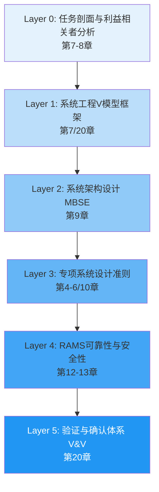

# 第7章 总体研发框架

**Marine Electric Drive System — R&D Methodology Engineering Handbook**

> 版本：v3.2（改进版） | 所属手册：船用电驱动系统研发方法论工程手册  
> 适用对象：新能源电力推进船舶（内河船 + 近海船 + 海船）  
> 系统范围：冷却–传动–控制三子系统耦合平台  
> **本版本新增**：与第24章90天路线图对接 | 第25章战略地位说明 | 按工程师角色的快速导航

---

## 1.1 问题导入：为什么需要这套方法论？

船用电驱系统研发为什么难？

**三个维度的复杂性：**

```
1. 多物理域耦合
   ├─ 电能 + 热能 + 机械能 ← 强耦合，难以独立优化
   ├─ 冷却系统 ←→ 电机 ←→ 控制系统，任何一个失误都会被放大
   └─ 海上工况的恶劣性 ← 地面试验无法完全覆盖

2. 多利益相关者冲突
   ├─ 船东要续航长 ← 需要大电池 ← 重量增加 ← 船体稳性受影响
   ├─ 船厂要好安装 ← 需要紧凑设计 ← 散热困难 ← 电机温升控制难
   ├─ 船级社要合规 ← 需要备份/冗余 ← 成本增加
   └─ 运维要可靠 ← 需要自诊断 ← 软件复杂度爆炸

3. 规范体系不完全成熟
   ├─ 新能源电推船的规范还在快速迭代（CCS每年更新）
   ├─ 国际没有通用标准，不同船级社要求差异大
   └─ 工程师需要在"规范不清"的情况下做出设计决策
```

**这套方法论解决什么问题？**

1. ✅ **需求明晰化**：从船东模糊的"续航要长、成本要低"，分解出120+条量化的工程需求
2. ✅ **架构合理化**：用系统工程方法，在众多设计方案中找到最优的平衡点
3. ✅ **风险前置化**：不等到海试再发现问题，而是在设计阶段就识别并处理风险
4. ✅ **流程标准化**：用统一的文件体系、检查清单、测试规程，降低工程师的决策成本

**关键目标：在3个月内（从D0到交付），将一个新的电驱系统从零推进到生产，并确保质量、进度、成本三个约束同时满足。**

---

## 1.2 六层架构：自顶向下的设计分解

本手册的核心是一个**六层金字塔架构**——每一层都有明确的输入、输出和检查单。

### 层级定义与对应章节


│ 验证方法：分析(A) + 仿真(S) + 检查(I) + 试验(T)           │
└─────────────────────────────────────────────────────────────┘
                          ↓
┌─────────────────────────────────────────────────────────────┐
│ 扩展Layer：新技术与前沿（第17章-13, 第24章-24）                │
│ 规范合规映射、差异化设计、新能源特有、90天路线图            │
│ 工具链建设、功能安全、故障诊断、测试体系、商业化            │
│ 技术路线图、手册总结、混合动力案例                          │
└─────────────────────────────────────────────────────────────┘
```

### 六层架构与手册24章的完整对应关系

| 方法论层级 | 覆盖内容 | 核心输出物 | 对应手册章节 |
|-----------|--------|---------|------------|
| **Layer 0** | 任务剖面、利益相关者分析、KPI定义 | 任务剖面表、KPI清单 | 第7章 (1.5)、**第8章** |
| **Layer 1** | V模型框架、阶段门、VCRM建立 | VCRM初版、M1/M2/M3门控清单 | 第7章、**第20章**、**第24章** |
| **Layer 2** | MBSE五视图、公理化设计、Trade Study | 系统架构图、N²矩阵、ICD初版 | **第9章** |
| **Layer 3a** | 冷却系统设计 | 热计算书、降额律、P&ID图 | **第6章** |
| **Layer 3b** | 传动系统设计 | 轴系校中、扭振分析、选型计算书 | **第4章** |
| **Layer 3c** | 控制系统设计 | 控制架构、FOC参数、热保护逻辑、软件需求规格 | **第5章** |
| **Layer 3d** | 多物理域仿真 | Simulink/AMESim模型、仿真验证报告 | **第10章** |
| **Layer 4a** | 可靠性与安全工程 | FMEA、FTA、MTBF预测、RAMS报告 | **第12章** |
| **Layer 4b** | 接口管理与集成 | ICD Rev.B、集成测试规程、FAT/SIT计划 | **第11章** |
| **Layer 4c** | 运行相图与降级 | 相图设计文件、七级降级状态机 | **第21章** |
| **扩展-规范** | 船级社规范、合规映射、CMM矩阵 | 审图资料包、合规证据链 | **第17章** |
| **扩展-差异** | 内河/海船差异化参数、升规检查清单 | 差异化设计决策表、参数对照表 | **第18章** |
| **扩展-新能源** | 电池热失控、轴承腐蚀、低温析锂、多机协调 | 新能源风险识别报告、专项设计方案 | **第19章** |
| **Layer 5** | 验证与确认体系、VCRM管理 | VCRM最终版、FAT/SAT报告、入级证书 | **第20章** |
| **执行路线** | 90天项目启动到M3的周密计划 | D0-D90周级工作计划、里程碑检查单 | **第24章** |
| **工具与人才** | 工具链建设、团队能力矩阵、学习路径 | 工具清单、人才培养地图、SOP库 | **附录B** |
| **功能安全** | 安全功能识别、SIL定级、PFD计算、E-STOP设计 | SFR规范、安全架构设计、认证文件 | **第13章** |
| **故障诊断** | 故障码定义、诊断决策树、远程监控、可靠性增长 | 故障码清单、故障排除手册、数据追踪 | **第22章** |
| **新能源技术** | 氨推进、燃料电池、混合动力、电池技术、充电 | 技术方案对标表、TCO分析、演进路线图 | **第27章** |
| **测试体系** | 陆地台架测试、海试验证、数据管理、加速寿命 | FAT计划、SIT规程、SAT检查单、数据库设计 | **第23章** |
| **商业化** | 产品成本分解、供应链、质量体系、销售规划、知识产权 | BOM清单、供应商评分卡、QMS手册、5年规划 | **第26章** |
| **技术路线图** | 2024-2050技术演进、竞争分析、组织建设、融资规划 | 3阶段路线图、人才招聘计划、融资方案 | **第28章** |
| **手册总结** | 三层核心领悟、常见陷阱、后续行动建议 | 核心要点汇总、进阶学习指南、案例库索引 | **第29章** |
| **综合案例** | 混合动力推进系统作为当前最优解的完整实现 | 需求→架构→设计→试验→商业化全流程 | **第25章** |

**新：第25章战略地位说明 → 见1.6.1节**

---

## 1.3 从需求到验证：V模型的左右对称

V模型是本手册的**方法论核心**。它回答一个基本问题：

> "设计时就要定义验证方法，而不是设计完再想怎么验证"

### V模型的两个重要特点

**特点1：左边=分解，右边=验证，必须对称**

```
需求层级              验收标准              验证阶段              验收准则
─────────────────────────────────────────────────────────────────────

系统需求(L1)  ─ 115条系统级需求 ─→  系统验收试验(SAT)
   │                                    └─ 航行试验
   │                                    └─ 整船性能/噪声/续航验证
   │
   ├─→ 子系统需求(L2)  ─ 90条子系统需求 ─→  子系统集成测试(SIT)
   │       │                               └─ 台架联合运行
   │       │                               └─ 热平衡/扭矩分配/热保护
   │       │
   │       └─→ 组件需求(L3)  ─ 100条组件需求 ─→  组件功能试验(FAT)
   │               │                            └─ 台架性能/可靠性
   │               │
   │               └─→ 详细设计  ─→ 分析+仿真验证
   │                   ├─ 冷却计算书(热能平衡)
   │                   ├─ 扭振分析(Campbell图)
   │                   ├─ 轴系校中(接触应力)
   │                   ├─ 控制仿真(Simulink)
   │                   └─ 热学仿真(AMESim)
   │
   └─────────→ 需求规格书(SRS)
               定义每条需求的：
               □ 量化指标
               □ 验证方法(A/S/I/T)
               □ 验证责任人
```

**特点2：设计决策与验证方案同时产出**

| 设计决策 | 验证方案 | 对应VCRM条目 | 关键里程碑 |
|--------|--------|-----------|---------|
| 选择P型混合架构 | Trade Study对标(分析) + 仿真对比(仿真) | REQ-ARCH-001 | M2（Day 60） |
| 柴油机额定功率160kW | 台架性能曲线(试验) + 续航仿真(仿真) | REQ-POWER-001 | FAT（M4） |
| 电池容量100kWh | 续航计算(分析) + 航行验证(试验) | REQ-BAT-001 | SAT（M6） |
| 冷却液最高入口温度45°C | 热设计计算(分析) + 台架热平衡(试验) | REQ-COOL-002 | FAT（M4） |
| 三级热保护阈值155/165/175°C | Stateflow仿真(仿真) + HIL故障注入(试验) | REQ-CTRL-003 | SIT（M5） |

---

## 1.4 阶段门与里程碑：项目的质量关口

项目分为**6个里程碑**，每个里程碑是一道质量门。未通过门控，不得进入下一阶段。

### 里程碑定义与检查单（简化版）

#### M0：D0启动会（Day 0）

**目标**：确认项目基本信息，启动执行

**M0 检查单**（7条强制检查）：
- [ ] 项目基本信息确认（船型、功率、船级社）
- [ ] 利益相关者清单完整，各方联系人确认
- [ ] 新能源风险快速筛查完成（第19章七大问题）
- [ ] 船型定位完成（第18章决策树，内河vs海船）
- [ ] 规范版本锁定（CCS/DNV版本号+生效日期）
- [ ] 项目文件夹结构建立（D0完成）
- [ ] 各子系统负责工程师指定、职责划分

---

#### **M1：D30需求冻结评审**（Day 30）

**目标**：需求基线建立，进入架构设计阶段

**M1 输出物**：
- 需求规格书(SRS) ≥30页，≥115条需求
- VCRM初版（所有需求已编号，验证方法标注≥70%）
- 新能源风险识别报告（七大问题逐项评估）
- 船型定位文档（正式发布）

**M1 检查单**（15条）：
```
需求质量检查：
  □ 每条需求有唯一编号（REQ-XXX-nnn格式）
  □ 每条需求有可量化验收准则（"不超过""不低于"具体数值）
  □ 每条需求有来源追溯（合同/规范/KPI/需求评审确认）
  □ 需求分层完整（L1系统 → L2子系统 → L3组件三层）
  □ 系统需求总数≥115条（经验基准值）
  □ 需求冲突数量≤2（存在冲突已列出并协商）
  □ 与船级社沟通完成（预沟通纪要存档）

VCRM质量检查：
  □ 所有需求条目在VCRM中建立
  □ 验证方法分配率≥70%（每条需求标注A/S/I/T）
  □ 未分配验证方法的条目≤15条（列出整改计划）
  □ VCRM初始关闭率=0%（基线建立）

新能源特有检查：
  □ 七大特有问题逐项评估（适用/不适用标注）
  □ 适用项目标记为"专项设计"，进入工作计划
  □ 新能源相关需求编号单独标记（便于追踪）

利益相关者确认：
  □ 船东在SRS上签字确认
  □ 船厂在SRS上签字确认
  □ 合规人员在规范清单上签字确认
```

**关键：M1 未通过 = 项目不进入下一阶段，无例外**

---

#### **M2：D60架构设计评审**（Day 60）

**目标**：系统架构定型，所有接口L3冻结

**M2 输出物**：
- 系统架构设计文档（架构图、功能框图、MBSE五视图）
- ICD v2.0（≥8份关键接口，冷却/传动/控制全覆盖）
- FMEA初版（功能层失效分析，≥50条目）
- 冷却/传动计算书初版（关键参数初算）
- Simulink/AMESim仿真模型v1.0（可运行）
- 供应商技术应答（至少2家竞标）

**M2 检查单**（12条）：
```
架构完整性：
  □ 系统功能框图完整，冷却/传动/控制三子系统接口明确
  □ 电气拓扑定型（DC母线电压等级、AC/DC方案固定）
  □ N²接口矩阵完整，≥12个接口全部识别
  □ 高风险接口（热接口、通信接口）已风险评估

ICD冻结：
  □ P1接口（5个）L3冻结（冷却供给/散热功率/编码器信号等）
  □ P2接口（5个）L3冻结（供电/控制指令等）
  □ 每份ICD满足九要素（标识/描述/物理规格/功能参数等）
  □ ICD版本=Rev.A（冻结版本前缀）

FMEA成熟度：
  □ 系统级FMEA完成（≥50条失效模式）
  □ RPN>200的高风险项已标识（≤5条目标）
  □ 所有"安全关键"失效模式已标红并记入第13章(功能安全)

设计计算：
  □ 冷却系统：热计算基本完成，K₁/K₂公式推导（临界点确定）
  □ 传动系统：螺旋桨匹配、功率对标完成
  □ 控制系统：架构层次确定，通信协议版本确定
```

**关键：M2 未通过 = 架构有严重缺陷，不进详细设计**

---

#### **M3：D90子系统设计评审**（Day 90）

**目标**：子系统详细设计完成，进入FAT/采购阶段

**M3 输出物**（每个子系统）：
- 详细设计说明书（冷却/传动/控制各一份，≥15页/份）
- ICD Rev.B（最终版，所有参数确定）
- FMEA最终版（详设阶段新发现的失效模式已补充）
- 关键设计计算书（冷却、扭振、轴承、放电电阻等）
- HIL平台搭建完成（场景01-05验证通过）
- CCS审图资料初稿（含扭振报告、热管理书、轴系计算）
- 供应商最终选定（合同或协议已签）

**M3 检查单**（12条）：
```
详细设计完整性（每个子系统）：
  □ 冷却系统：泵选型、换热器选型、降额律K₁/K₂/T_warn/T_trip确定
  □ 传动系统：扭振Campbell图完成、轴系对中设计、电机选型确定
  □ 控制系统：FOC参数整定表、热保护逻辑、软件需求规格(SRS)完成
  □ 新能源特有：热失控方案、轴承腐蚀防护、低温充电限制完成

设计计算书齐全：
  □ 冷却计算书（ε-NTU、NPSH、管网压降）- Word受控版
  □ 传动计算书（螺旋桨负载、轴系应力、轴承寿命）- Word受控版
  □ 轴系扭振分析（IACS UR M13格式，Campbell图清晰）
  □ 放电电阻计算书（时间常数、脉冲功率）

接口冻结：
  □ ICD Rev.B全部发布，双方（发送方/接收方）工程师签字
  □ 所有接口参数数值确定，无"TBD"悬挂条目
  □ ECR流程就绪（M3后的接口变更必须经ECR审批）

仿真与验证启动：
  □ Simulink模型可运行，热保护逻辑仿真验证Pass
  □ HIL平台硬件搭建完成，前5个场景验证通过（截图保存）
  □ 台架试验计划制定完成（场地/时间/项目/见证方确定）

VCRM更新：
  □ A类(分析)验证条目关闭率≥80%（附计算书编号）
  □ I类(检查)验证条目关闭率≥70%（附设计文件编号）
  □ S类(仿真)验证条目关闭率≥60%（附仿真报告）
  □ T类(试验)验证条目状态更新为"已排期"（附计划编号）
  □ 总关闭率≥60%

新能源专有完成：
  □ 热失控防护方案定型（四层防护、灭火系统）
  □ 轴承电腐蚀防护确认（绝缘轴承型号+接地刷）
  □ 直流快速放电电阻选定（规格书含）
  □ 低温充电限制策略固化（温度-电流表写入BMS）

成本与采购：
  □ 关键长交期件采购单位已确定（电机/变频器/电池/PCS）
  □ BOM清单v1.0完成（成本估算准确度±15%）
  □ 供应商2-3家已选定，技术协议已签
```

**关键：M3 检查单任一项未通过 = 限期整改，不得进入制造**

---

#### **M4：FAT工厂验收试验**（Month 5-6）

各子系统（电机、变频器、控制器、电池、泵、换热器）的出厂验收试验。

---

#### **M5：SIT系统集成试验**（Month 7-8）

三子系统联合运行验证（台架，48-72h耐久试验）。

---

#### **M6：SAT航行试验 + 交付**（Month 9-11）

整船系泊试验 + 航行验收 + 船级社入级检验 + 最终交付。

**→ 详见第24章《90天落地执行路线》（D0-D90详细周计划）**

---

## 1.5 六层架构与第25章（混合动力推进系统）的战略地位

### 1.5.1 第25章为什么在最后？

**不是"最不重要"，而是"最综合最关键"。**

第25章（混合动力推进系统）是前23章理论知识的**完整实践指南**：

```
前1-23章的作用                    第25章的作用
════════════════════════════════════════════════════════

第7章-5：需求→架构→冷却          ═→
第5章-10：控制→仿真→可靠性        ═→
第17章-13：合规→差异→新能源特有   ═→  混合动力推进系统
第20章-16：V&V→路线→工具           ═→  作为2024-2030
第13章-23：安全→诊断→路线          ═→  的最优解的
                                 完整应用案例

知识流：从抽象理论 ──→ 具体系统实现
        从方法论 ──→ 工程实战
```

### 1.5.2 混合动力的四层价值

| 价值维度 | 说明 |
|--------|------|
| **技术价值** | 综合展现前23章所有设计原则：需求分解、架构权衡、多工况设计、安全冗余 |
| **市场价值** | 2024-2030年内河/港口最现实的增量市场，有大量真实运营数据支撑 |
| **学习价值** | 新工程师通过混合动力案例快速理解"从0到1如何做电驱设计" |
| **战略价值** | 为2030-2050零碳方案（燃料电池/氨推进）奠定坚实的技术与供应链基础 |

### 1.5.3 混合动力与零碳方案的关系

```
2024年阶段          2030年阶段           2050年愿景
═════════════════════════════════════════════════════

内河纯电船          混合动力船①          燃料电池船
港口拖轮（纯电）  混合动力港拖②        氨推进远洋船
长江商船            混合货轮              零碳绿色航运

                   ↑
             第25章的位置：
          当前最优 + 未来过渡
          
现在选混合动力的原因：
  ✓ 技术成熟(200+艘已在运营)
  ✓ 成本合理(投资回本3-5年)
  ✓ 排放减少(NOx/PM 30-50%)
  ✓ 为零碳升级预留接口(能量管理架构可升级至燃料电池)
```

**第25章的15个关键工程问题：**

1. 如何选择S/P/PS三种混合架构？ → 第25章2.2节
2. 柴油机怎么降速运行效率还要高？ → 第25章3.5节
3. 电池容量多大才够？ → 第25章5.2节（续航计算）
4. 怎么控制转矩分配？ → 第25章8节（EMS算法）
5. 冷却液怎么既冷柴油机又冷电机？ → 第25章7节（热管理）
6. 为什么需要热失控防护？ → 第25章12.1节（电池安全）
7. 港口充电怎么协调？ → 第25章9节（运行模式）
8. 成本怎么降？生命周期成本多少？ → 第25章11节
9. 可靠性目标怎么设？MTBF多少？ → 第25章11.2节
10. 两个故障案例分析 → 第25章12节

---

## 1.6 按工程师角色的快速导航

### 不同岗位推荐的阅读路径

#### 👷 **系统工程师 / 项目经理**
推荐阅读顺序：**第7章 → 第8章 → 第9章 → 第12章 → 第11章 → 第20章 → 第24章 → 第25章**

```
核心工作内容：需求管理、架构设计、接口协调、整体进度
关键输出物：VCRM、架构文档、ICD、FAT/SAT报告

学习路径：
  Week 1: 第7章-2（需求工程基础）
  Week 2: 第9章（架构方法）
  Week 3: 第12章-9（RAMS + 接口管理）
  Week 4: 第20章-15（V&V体系 + 90天执行）
  Week 5: 第25章（混合动力全系统理解）

关键技能：需求分解、风险管理、进度管理、团队协调
```

---

#### 🧊 **冷却系统工程师 / 热管理工程师**
推荐阅读顺序：**第7章 → 第6章 → 第10章 → 第21章 → 第20章 → 第25章**

```
核心工作内容：热设计、换热计算、降额律、冷却系统集成
关键输出物：热计算书、降额律、冷却系统P&ID、FAT报告

学习路径：
  Week 1: 第7章（框架背景）
  Week 2: 第6章（冷却系统五步设计法）
  Week 3: 第10章（仿真模型搭建）
  Week 4: 第21章（降额律标定）
  Week 5: 第20章（验证体系）
  Week 6: 第25章（混合动力冷却集成案例）

关键技能：热计算、ε-NTU法、污堵系数、降额逻辑设计
```

---

#### ⚙️ **传动 / 结构工程师**
推荐阅读顺序：**第7章 → 第4章 → 第10章 → 第11章 → 第20章 → 第25章**

```
核心工作内容：电机选型、轴系设计、扭振分析、联轴器配置
关键输出物：传动计算书、扭振分析、轴系校中、FAT报告

学习路径：
  Week 1: 第7章（项目背景）
  Week 2: 第4章（传动系统七步设计）
  Week 3: 第10章（仿真验证）
  Week 4: 第11章（接口定义，冷却/传动接口重点）
  Week 5: 第20章（验证方法）
  Week 6: 第25章（混合动力传动系统案例）

关键技能：扭振分析(Campbell图)、轴系对中、电机参数辨识
```

---

#### 🔌 **控制 / 软件工程师**
推荐阅读顺序：**第7章 → 第5章 → 第10章 → 第19章 → 第13章 → 第22章 → 第25章**

```
核心工作内容：控制算法、热保护逻辑、故障诊断、软件需求规格
关键输出物：SRS(软件需求规格)、控制架构、HIL验证报告

学习路径：
  Week 1: 第7章（V模型框架）
  Week 2: 第5章（控制系统设计：FOC、热保护、禁速区）
  Week 3: 第10章（仿真平台搭建）
  Week 4: 第19章（新能源特有：热失控状态机、SOC算法）
  Week 5: 第13章（功能安全与E-STOP）
  Week 6: 第22章（故障诊断决策树）
  Week 7: 第25章（混合EMS能量管理算法）

关键技能：FOC控制、状态机设计、HIL验证、故障诊断
```

---

#### 📋 **合规 / 认证工程师**
推荐阅读顺序：**第7章 → 第8章 → 第17章 → 第18章 → 第19章 → 第24章 → 第25章**

```
核心工作内容：规范研究、CMM矩阵、CCS沟通、合规风险管理
关键输出物：CMM矩阵、审图资料包、合规证据链、入级证书

学习路径：
  Week 1: 第7章（框架理解）
  Week 2: 第8章（需求与KPI）
  Week 3: 第17章（合规映射）
  Week 4: 第18章（内河/海船差异规范）
  Week 5: 第19章（新能源电推特有规范要点）
  Week 6: 第24章（90天合规里程碑）
  Week 7: 第25章（混合动力的特殊合规要点）

关键技能：规范解读、CMM管理、CCS沟通技巧、审图资料整理
```

---

#### 🏭 **采购 / 供应链工程师**
推荐阅读顺序：**第7章 → 第9章 → 第6章-6 → 第26章 → 第25章**

```
核心工作内容：供应商选型、成本管理、BOM编制、招标规范
关键输出物：BOM清单、供应商评分卡、采购框架协议、成本分解表

学习路径：
  Week 1: 第7章（项目周期、里程碑计划）
  Week 2: 第9章（系统架构）
  Week 3: 第6章-6（冷却/传动/控制核心参数与选型要点）
  Week 4: 第26章（商业化与产品化 - 供应链管理）
  Week 5: 第25章（混合动力的供应商体系）

关键技能：成本分析、供应商管理、招标评估、长交期风险管理
```

---

#### 🚀 **新人 / 培训生（快速上手）**
推荐阅读顺序：**第7章 → 第25章 → 再读一遍前23章（深化理解）**

```
第一阶段（1周）：快速全景了解
  □ 第7章：理解六层架构与V模型
  □ 第25章：通过混合动力案例看全流程
  → 能回答："船用电驱系统研发从哪到哪？"

第二阶段（4周）：系统深入学习
  □ 第8章-3：需求→架构（基础）
  □ 第6章-6：三子系统设计（专业）
  □ 第10章-10：仿真、可靠性、合规（高阶）
  □ 第20章-24：验证、执行、案例（实战）
  → 能回答："为什么这样设计？有什么其他选择？"

第三阶段（2-4周）：项目实战
  □ 参加实际项目的M1/M2/M3评审
  □ 在真实产品上应用各章的工程方法
  □ 建立个人的"设计决策依据库"

预期：1个月快速上手，3个月独立负责模块，6个月领导小项目
```

---

## 1.7 常见误区与纠正

| 误区 | 表现 | 正确做法 |
|------|------|---------|
| **误区1：需求还不清就开始选型** | 第15天就在问"哪个品牌电机"，SRS一行没写 | ✅ M1（Day30）需求冻结前，供应商只发RFI，不发RFQ |
| **误区2：V模型不对称** | 设计时只想着"怎么做"，不想"怎么验证" | ✅ 每个设计决策都要定义验证方法(A/S/I/T)和成功标准 |
| **误区3：FMEA流于形式** | FMEA表格照抄模板，没有结合实际运营场景 | ✅ 邀请船东/船厂/运维人员参与评审，逼出真实风险 |
| **误区4：接口模糊冻结** | ICD里写"冷却液供给"，没写流量/温度/压力范围 | ✅ 九要素完整，参数量化，L3冻结前双方签字 |
| **误区5：规范预沟通晚了** | 设计完了才问船级社，结果需要大改 | ✅ D1个月内完成预沟通，D60前提交第一阶段审图 |
| **误区6：M1/M2/M3做作** | 形式上通过门控，实际上问题累积 | ✅ 门控检查单严格执行，未通过不进入下一阶段 |

---

## 1.8 与第24章《90天落地执行路线》的对接

**本章定义的"方法论框架"在第24章得到"操作化的实现"。**

### 关键对应关系

| 本章内容 | 在第24章中如何展开 |
|--------|-----------------|
| **Layer 0（任务剖面）** | Week 1-2（D1-D14）：利益相关者访谈与任务剖面量化 |
| **Layer 1（V模型）** | Week 3-4（D15-D30）：需求评审与VCRM基线建立（M1） |
| **Layer 2（架构设计）** | Week 5-8（D31-D60）：架构定型、ICD冻结（M2） |
| **Layer 3（专项设计）** | Week 9-12（D61-D90）：详细设计、HIL验证（M3） |
| **M0检查单（7条）** | 第24章D0快速检查清单 |
| **M1检查单（15条）** | 第24章Day 30门控审查 |
| **M2检查单（12条）** | 第24章Day 60门控审查 |
| **M3检查单（12条）** | 第24章Day 90门控审查 |

**→ 详见第24章1.1节《与第7章框架的对接说明》**

---

## 1.9 本章小结与关键输出物

### 本章核心要点（四条）

1. **六层架构自顶向下展开，不得跳层**
   - Layer 0（任务剖面）是一切设计的源头，任务剖面不准确 → 下游设计系统性偏差
   - 每层都有明确的输入/输出/检查单，缺一不可

2. **V模型左右对称，设计时就定义验证方法**
   - 每个设计决策在做出时就必须回答"如何验证这个决策是正确的"
   - 试验是最昂贵的验证方法，前置规划可降低试验成本50%+

3. **阶段门是质量关口，不是走形式的节点**
   - M0/M1/M2/M3检查单全部通过才能进入制造阶段
   - 任何"先做后补"的做法都会埋下隐患（返工代价100-1000倍）

4. **第25章不是"附加技术方案"，而是前23章的综合集成**
   - 混合动力是2024-2030最现实可行的方案
   - 为2030-2050零碳过渡预留完整的技术和供应链基础

### 关键输出物（项目启动时必须交付）

**D0阶段**：
- [ ] 项目基本信息表（船型、功率、船级社、首交期）
- [ ] 利益相关者清单与联系方式
- [ ] 规范版本锁定记录（CCS/DNV版本号）

**M1阶段（Day 30）**：
- [ ] 需求规格书(SRS v1.0) - ≥30页，≥115条需求
- [ ] VCRM初版（Excel）- 所有条目编号，验证方法标注≥70%
- [ ] 新能源风险识别报告 - 七大问题逐项评估
- [ ] 项目阶段计划（甘特图）- M2、M3、FAT、SIT、SAT时间节点

**M2阶段（Day 60）**：
- [ ] 系统架构设计文档（MBSE五视图）
- [ ] ICD v2.0（≥8份，全部L3冻结）
- [ ] FMEA初版报告
- [ ] 冷却/传动初步计算书

**M3阶段（Day 90）**：
- [ ] 所有子系统详细设计说明书
- [ ] ICD Rev.B（最终版）
- [ ] FMEA最终版
- [ ] CCS审图资料初稿包
- [ ] HIL验证报告（场景01-05 Pass）
- [ ] VCRM更新（关闭率≥60%）

---

## 1.10 按工程师角色的快速导航与自学指南

### 推荐的分角色快速开始

**( 完整导航见 1.6 节 )**

**如果你是管理层**：
```
最少阅读：第7章（本章） + 第24章（90天路线） + 第29章（总结）+ 第25章（案例）
时间：2-3天
目标：理解项目的整体架构和风险点
```

**如果你是技术负责人**：
```
完整阅读：所有24章（第一遍粗读，第二遍精读相关章节）
时间：4周
目标：建立完整的工程方法论体系
```

**如果你是新工程师**：
```
第一周：第7章（框架）+ 第25章（案例）- 快速全景理解
第二周：第8章-3（需求与架构）- 基础知识深化
第三周：对应专业方向的章节（第6章/5/6等）- 专业化学习
第四周+：在实际项目中应用，建立personal playbook
```

---

## 1.11 与其他章节的导读关联

```
本章 ─→ 如果想深入某个领域 ─→ 推荐阅读

1.1（问题导入）
  └─→ 理解船用电推系统为什么难
      推荐：第8章-3（系统工程基础）

1.2（六层架构）
  └─→ 学习每一层的具体做法
      推荐：第9章-13（各层详细展开）

1.3（V模型）
  └─→ 掌握需求与验证的对应关系
      推荐：第20章（VCRM管理）

1.4（阶段门）
  └─→ 了解项目风险管理的关键节点
      推荐：第24章（90天执行）、第12章（RAMS）

1.5（第25章地位）
  └─→ 通过混合动力案例学习整套方法
      推荐：第25章（完整案例分析）

1.6（角色导航）
  └─→ 按自己的职位选择学习路径
      推荐：对应专业方向的章节

1.10（快速开始）
  └─→ 针对新工程师的自学计划
      推荐：按章节顺序系统学习
```

---

## 本章完

这一章建立了全书的骨架——如果你理解了六层架构、V模型、阶段门的含义，后续23章的学习就会变得事半功倍。

**下一章：第8章《利益相关者与需求工程》**  
深入展开Layer 0，讲如何从船东、船厂、船级社、运维方的四类需求，分解出120+条量化的系统工程需求。

